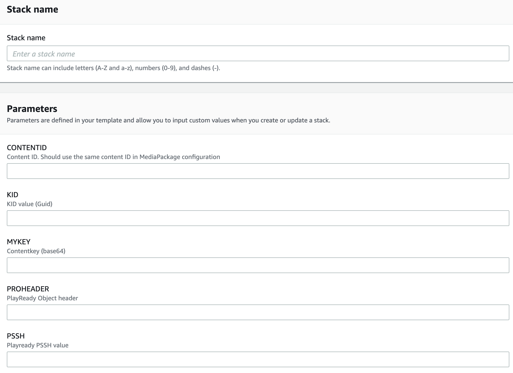
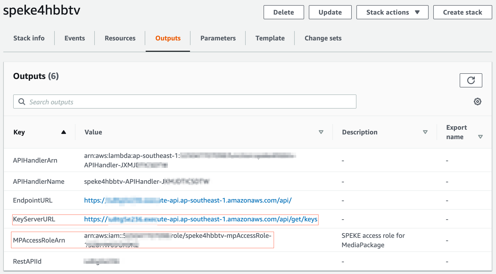
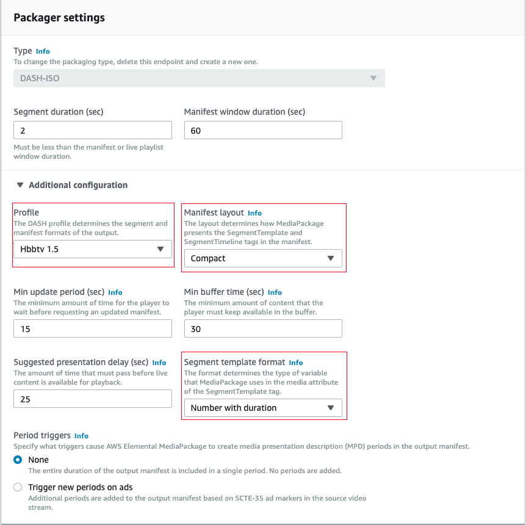
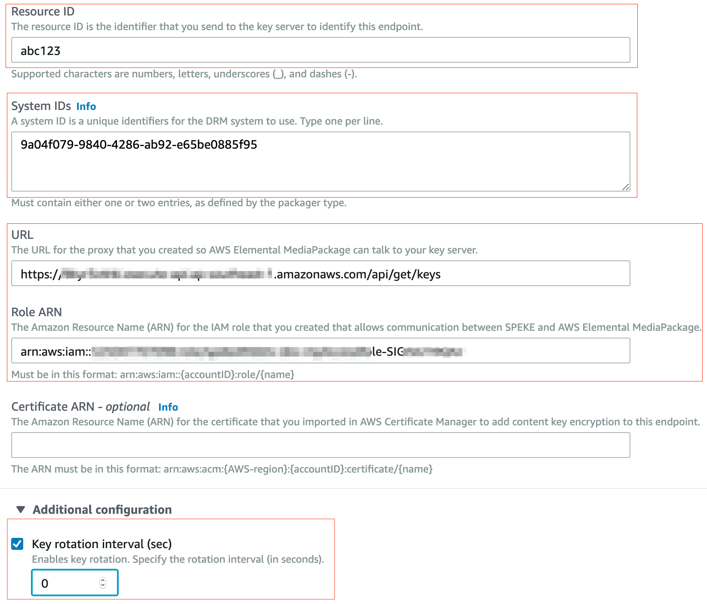

# Speke4hbbtv
SPEKE (Secure Packager and Encoder Key Exchange) defines the standard for communication between AWS Media Services and digital rights management (DRM) system key servers. 

Speke4hbbtv is a reference SPEKE implementation to test PlayReady DRM Key Server with MediaPackage. This reference key server is only meant for static key implementation. PSSH box and PRO(PlayReady Object) headers needs to be externally created. In future this reference implementation can be used as a proxy in between a PR key server and also AWS MediaServices.

## Installation

You may be able to use this cloudFormation template [speke4hbbtv-build.template](https://raw.githubusercontent.com/djlynux/speke4hbbtv/master/speke4hbbtv-build.template) to deploy the reference server in your AWS account. We recommend you to build your own package.

If you want to build the entire package by yourself, follow the steps below.

### Prerequisites

The entire package is written in Chalice and Python3.7. Here is the basic requirements to build the necessary packages. 

```
python3
pip
awscli
virtualenv
git
```

Make sure that these packages are already installed in your system.

### Build instructions for developers

1. As a first step configure AWS CLI with an IAM user that has create resource privileges. For more details refer this [article](https://docs.aws.amazon.com/cli/latest/userguide/cli-chap-configure.html).
2. Clone this repo in your local environment.
   
   ``` 
   git clone https://github.com/djlynux/speke4hbbtv.git
   ```
3. It's always better to create a virtual environment to create the build
   
   ``` 
   virtualenv .venv/
   source .venv/bin/activate
   ```
4. Install chalice in your environment.
   
   ``` 
   pip install chalice 
   ```
5. Create a new S3 bucket to keep the deployment files. You can use `AWS CLI` or `AWS Console`.
6. Open the `build.sh` file and change the following two variables.
   ```
   BUCKETNAME="speke4hbbtv-pkgbuild"
   TEMPLATENAME="speke4hbbtv-dev.template"
   ```
7. After making the changes mentioned in the step 7, run `build.sh` to create the CloudFormation template and also the build files. Lamabda scripts will be zipped and copied to the S3 bucket that you have configured earlier.
   ```
   sh build.sh
   ```
8. There are basically two build files, one is a CloudFormation template which will be created in the same folder where the build script is and the zipped lambda codes will be uploaded to the s3 bucket that you've created in step 5.
9. You can deploy the CloudFormation template in your AWS account via web console or CLI.

### Deployment
* Go to the CloudFormation service page in AWS console.
* Click on create new stack and choose the `YAML` file that we have created earlier. Then click the next button.
* In the next page fill in all the encryption specific parameters that you can obtain from your DRM provider. Then wait till the deployment is completed.

* Once the deployment is completed, click on the output section of the stack you've just created and note down the parameters `KeyServerURL` and `MPAccessRoleArn`

* Create a new dash end-point in your MediaPackage channel.
* Under packager settings, expand the additional configuration. Then Select `hbbtv1.5` from the drop down list and also choose `Compact` manifest. Make sure that you've also selected time with

* Then at the encryption settings choose `Resource ID`, which is same as the the environment variable that you choose during CF deployment. Then also choose `System ID` for PlayReady (`9a04f079-9840-4286-ab92-e65be0885f95`)
*  Then update the URL and Role ARN section with the results from the CF template outputs. Make sure that `Key rotation interval (sec)` as zero.

* If you want to change the DRM configuration to a new key, you can go to the lambda configuration and change the environment variables there.
### Author
* Subin Hutton(@djlynux): subinh.dev@gmail.com

### References

* Chalice: https://chalice.readthedocs.io/en/latest/
* PlayReady Header Specification: https://docs.microsoft.com/en-us/playready/specifications/playready-header-specification
* SPEKE: https://docs.aws.amazon.com/speke/latest/documentation/what-is-speke.html


